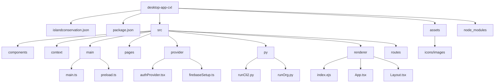

# desktop-app-cxl

**This Desktop App was built using [Electron React Boilerplate](https://electron-react-boilerplate.js.org/) and [Python Shell](https://www.npmjs.com/package/python-shell)**. Uses [Sentinel-Cli](https://github.com/cxl-garage/sentinel-cli) python code. **Only works on Windows**. You also must download and sign in to [Docker Desktop](https://www.docker.com/products/docker-desktop/) to successfully run CXL ML models.

## Pre-requisites

Python version `3.10.2`

## Local setup

1. After cloning and going into repo, run `yarn install`
2. Initiliaze the local sqlite db by running `yarn make-db`
3. To start the app, run `yarn start`

## Helpful Resources for Electron Inter-Process Communication

**Used this to communicate between main processes and renderer (frontend)**


- [Electron IPC](https://codex.so/electron-ipc)
- [Typescript Electron IPC Response/Request](https://blog.logrocket.com/electron-ipc-response-request-architecture-with-typescript/)

## Higher Level App Structure

Overview: the ML models are run through a python script that starts a docker container locally.

**Most important folders and files in desktop-app-cxl**



## Detailed Description of Structure:

### src/main/

**Summary: contains all the key process codes and related modules, reads, writes files and runs python-shell**

- preload.ts: install python requirements, use [contextBridge](https://www.electronjs.org/docs/latest/api/context-bridge)
  - functions use channel to communicate from **renderer** process to **main** process
  - send **message to main process**
  - electron api functions
    - \*\*overview: functions run pythonshell, write files locally, read files locally, open browser window, and select local directories"

```
const WINDOW_API = {
 FindOrgModels: async (arg: any) => ipcRenderer.invoke('run/find-org-models', arg), //runs python shell with inputted org
 RunModel: async (arg: any) => ipcRenderer.invoke('run/model', arg), //runs all user inputs and outputs results of user inputted model
 WriteUserInputJson: async (arg: any)=> ipcRenderer.send('write/user-inputs-json', arg), //writes file of user input data from afterorg.tsx
 SelectInputFolder: async ()=> ipcRenderer.invoke('dialog:openDirectoryInput'), //allows to select directory for input folder of user's images
 SelectOutputFolder: async ()=> ipcRenderer.invoke('dialog:openDirectoryOutput'), //allows to select directory for output folder of the model results of user's images
 ReadLogFile: async () => ipcRenderer.invoke('read/log-file'), //read local logFile inside the app
 ReadUpdate: async () => ipcRenderer.invoke('read/update-file'), //read update.json file
 ReadResults: async () => ipcRenderer.invoke('read/results-file'), //read Results.json which has the number of objects, empty images, and the total images that the model was run over
 ReadModels: async () => ipcRenderer.invoke('read/models-file'), //read Models populated by runOrg.py for the inputed organization
 OpenWindow: async (arg: any)=> ipcRenderer.send('open/window', arg), //open new window of docker.desktop
 CountFiles: async (arg: any) => ipcRenderer.invoke('count/files', arg), //count the total number of local files
};

//exposes window api to renderer
contextBridge.exposeInMainWorld('electron', WINDOW_API);
```

- main.ts: [ipcMain](https://www.electronjs.org/docs/latest/api/ipc-main) processes
  - recieve messages from **renderer process** and **return value**

### src/renderer/

**Summary: UI related code and modules come under the renderer process folder**

- **\*App.tsx: has all the routes, and uses AuthProvider and AuthContext to get current **Firebase User**\***
  - passes down user from authContext
- preload.d.ts: declares window as global variable, which communicates with _ipcRenderer_
  - [Inter-Process Communication](https://www.electronjs.org/docs/latest/tutorial/ipc)
- Layout.tsx: applies Layout to all children if signed in; if not signed in, navigate to **login.tsx**
  - imports Navigation.tsx
- Navigation.tsx: Side-nav bar to different routes
- index.tsx and index.ejs
  - renders App from root

### src/py

- **\*runCli2.py**: main python script, uses user info to start docker container with inputted images\*
- **\*runOrg.py**: gets available models for given organization\*
- inputData.json: user inputs from afterorg.tsx page
- logfile.csv: logs most recent python script
- Models.json: models from inputed org
- progress.csv: for getting loading info but never got it to work
- readFile.py: read file code
- reqs.py: install reqs needed to run python script
- Results.json: results from main python script of images, empty number, and objects found
- utils.py: reused functions, used in main python scripts

### src/pages

**Contains different pages to navigate to**

- css folder
- dashboard.tsx: contains entry for putting in your org, runs first python script that populates models, on submit goes to afterorg.tsx
- afterorg.tsx: populates model dropdown
  - input output style, where to save images on computer, where to get the images on computer, confidence threshhold
  - writes user inputs to file
  - runs full docker container/model on images you inputed
  - on submit goes to results.tsx
- results.tsx: result of models
- profile.tsx: some profile info
- logs.tsx: python logs
- setup: download docker container from link

### src/components/

**Summary: reused components**

- logComponent.tsx
  - type: FunctionComponent
  - takes in data (log info & array) as props
  - returns formatted log component
- Navbar.tsx
- loggedOutNavbar
  - type: FunctionComponent
  - when user is logged out

# Download prisma binaries

You can find the commit hashes in the prisma-engines repository and choose the release you want: https://github.com/prisma/prisma-engines/tags

Then you can download them from: `https://binaries.prisma.sh/all_commits/[commit_hash]/[platform]/[engine-name].gz`

The platform name can be `windows`, `darwin`, or `darwin-arm64`

The engine names are `query-engine` or `schema-engine`

If you're downloading from windows, then remember to add `.exe` to the engine names (e.g. `query-engine.exe.gz`)

Once downloaded, copy and commit these to the `bin/` directory so they can be packaged when running `yarn package`
